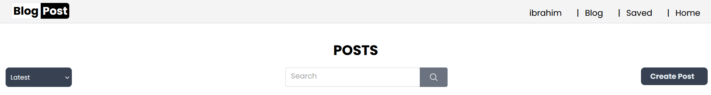
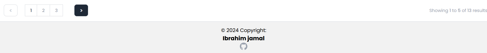

<p align="center"><a href="https://laravel.com" target="_blank"></a></p>

<p align="center">
<a href="https://github.com/laravel/framework/actions"></a>
<a href="https://packagist.org/packages/laravel/framework"></a>
<a href="https://packagist.org/packages/laravel/framework"></a>
<a href="https://packagist.org/packages/laravel/framework"></a>
</p>

## About Laravel
# Laravel Blog Application
 
 
  


### Features

#### User Authentication/Authorization and Admin/profile Management
- **User Registration and Login:** Manually implemented Secure user authentication register/login for full customization and best experience.
- **Admin Panel:** Admin page management system where admin can manage users block/delete users,manage posts delete/view/edit posts, and make user admin .
- **Profile Management:** Users can see their posts,number of posts,total likes/comments,and edit profile settings users must confirm their passwords before accessing this page,they can edit bio/name/email/change current password, and delete their account by confirming current password,including changing their profile image,update and delete current one.
- **Password Management:** Users can change their passwords and reset them if forgotten.
- **Email Verification:** User must verfied his email berfore making and action.
- **Middleware/Policies/Gate:** Implement custom middleware and policies on user/post for more secure.

#### Blog Posts
- **Create, Read, Update, and Delete (CRUD) Operations:** Users can create new blog post, edit existing one, and delete post they have authored.
- **Hashtags:** Users can create there own hashtags and filter posts by hashtag and sort hompage with trending hashtags including pagination.
- **Save Posts:** Implement Save/Unsave button using fetchApi, user can access to saved page, with the ability to view and remove saved posts.
- **Slugs:** Implemented a unique slug for each post to create descriptive, enhancing search engine visibility and improving user experience.
- **Like:** Implement Like/Unkike button using fetchApi with Like animation falling hearts for better user experience. 

#### Comments and Replies
- **Comment on Posts:** Users can add comments to blog posts.
- **Reply to Comments:** Users can replies to comments, creating nested comment system with reply on reply, they can see total replies on a comment with ability to hide and show those replies.
- **Delete Comments/Replies:** Users can delete their own comments and replies.

#### Post Sorting and Searching and pagination
- **Sort Posts:** User can sort posts by latest, oldest, most liked, and trending hashtags.
- **Search Functionality:** implemented scout driver,users can search for a certain post including pagination.
- **Pagination:** User can paginate between post pages. 

#### 🚀 All Pages Styled With TailwindCss ,more experience ,more responsive.
🔥🔥 Upcoming very soon Realtime notification ,follow/unfollow,account public/private.

## INSTALLATION
1.📦 Install dependencies
```
composer install
```
2.🛠️ Create a copy of the .env file
```
cp .env.example .env
```
3.🔑 Generate the application key
```
php artisan key:generate
```
4.📦 install node_modules
```
npm install
```
5.🚀 Compile assets with Tailwind CSS
```
npm run dev
```
6.🗄️ Set up the database
```
php artisan migrate
```
7.🔗 Create symbolic link for storage
```
rm public/storage
php artisan storage:link
```
8.🗄️ optional for testing 
```
php artisan db:seed
```
9.💻 Run the application
```
php artisan serve
```
## Admin Login
`Use these credentails to log in as admin`


- Email: admin@mail.ru.
- Pass : adminadmin123.

## Laravel RESTful API for this project 

All Requests start with http://127.0.0.1:8000/api

`Login`

- `POST /api/login` - login to get token access.

 `posts`
- `GET /api/blog` - Get all posts.No authentication required.
- `GET /api/posts/{post}` - Get single post.No authentication required.
- `POST /api/create` - Create new post , authentication required.
- `PUT /api/post/update/{post}` - Update authorized post, authentication required.
- `DELETE /api/post/{post}` - Delete authorized post, authentication required.

## Security Vulnerabilities

If you discover a security vulnerability within Laravel, please send an e-mail to Taylor Otwell via [taylor@laravel.com](mailto:taylor@laravel.com). All security vulnerabilities will be promptly addressed.

## License

The Laravel framework is open-sourced software licensed under the [MIT license](https://opensource.org/licenses/MIT).
